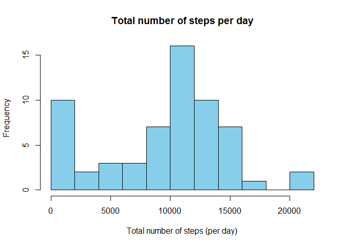
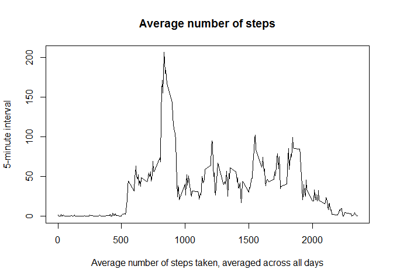
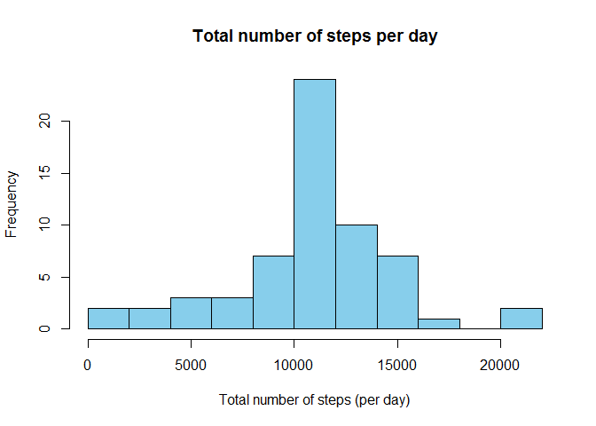

## R Markdown

This is an R Markdown document for the Reproducible Research peer-graded Assignment.


```r
library(lubridate)
```

```
## 
## Attaching package: 'lubridate'
```

```
## The following object is masked from 'package:base':
## 
##     date
```

```r
library(dplyr)
```

```
## 
## Attaching package: 'dplyr'
```

```
## The following objects are masked from 'package:lubridate':
## 
##     intersect, setdiff, union
```

```
## The following objects are masked from 'package:stats':
## 
##     filter, lag
```

```
## The following objects are masked from 'package:base':
## 
##     intersect, setdiff, setequal, union
```

```r
library(lattice)
```

Loading and preprocessing the data

```r
unzip("repdata_data_activity.zip")
ActData <- read.csv("activity.csv", na.strings = "NA")
ActData$date <- as.Date(as.character(ActData$date), format = "%Y-%m-%d")
ActData$year <- year(ActData$date)
ActData$month <- month(ActData$date)
ActData$day <- day(ActData$date)
```

### What is mean total number of steps taken per day?  

1.Total number of steps taken per day

```r
TotalStepsPerDay <- group_by(ActData, year, month, day) %>%
    summarise(daily_steps = sum(steps, na.rm = TRUE)) %>% 
    ungroup()
head(TotalStepsPerDay)
```

```
## # A tibble: 6 x 4
##    year month   day daily_steps
##   <dbl> <dbl> <int>       <int>
## 1  2012    10     1           0
## 2  2012    10     2         126
## 3  2012    10     3       11352
## 4  2012    10     4       12116
## 5  2012    10     5       13294
## 6  2012    10     6       15420
```

2.Histogram of the total number of steps taken each day

```r
hist(TotalStepsPerDay$daily_steps, main = "Total number of steps per day", col = "skyblue", breaks = 10, xlab = "Total number of steps (per day)")
```

<!-- -->

3.The **mean** and **median** total number of steps taken per day is **9354.23** and **10395** respectively.  

### What is the average daily activity pattern?
1.Time series plot 

```r
IntActData <- group_by(ActData, interval) %>% 
    summarise(steps = mean(steps, na.rm = TRUE)) %>% 
    ungroup()
with(IntActData, plot(interval, steps, type = "l", main = "Average number of steps", xlab = "Average number of steps taken, averaged across all days", ylab = "5-minute interval"))
```

<!-- -->
  
2.The 5-minute interval, on average across all the days in the dataset with the maximum number of steps is **835**  

### Imputing missing values  
1.The total number of missing values is 2304  
2.Imputing missing values based on the 5-minute interval mean.  

```r
ImpActData <- group_by(ActData, interval) %>% 
    mutate(steps = ifelse(is.na(steps), mean(steps, na.rm = TRUE), steps)) %>% 
    ungroup()
```
  

```r
head(ImpActData)
```

```
## # A tibble: 6 x 6
##    steps date       interval  year month   day
##    <dbl> <date>        <int> <dbl> <dbl> <int>
## 1 1.72   2012-10-01        0  2012    10     1
## 2 0.340  2012-10-01        5  2012    10     1
## 3 0.132  2012-10-01       10  2012    10     1
## 4 0.151  2012-10-01       15  2012    10     1
## 5 0.0755 2012-10-01       20  2012    10     1
## 6 2.09   2012-10-01       25  2012    10     1
```
  
3.Total number of steps taken per day (without missing data)  


```r
TotalStepsPerDay1 <- group_by(ImpActData, year, month, day) %>%
    summarise(daily_steps = sum(steps, na.rm = TRUE)) %>% 
    ungroup()
head(TotalStepsPerDay1)
```

```
## # A tibble: 6 x 4
##    year month   day daily_steps
##   <dbl> <dbl> <int>       <dbl>
## 1  2012    10     1      10766.
## 2  2012    10     2        126 
## 3  2012    10     3      11352 
## 4  2012    10     4      12116 
## 5  2012    10     5      13294 
## 6  2012    10     6      15420
```
  

```r
hist(TotalStepsPerDay1$daily_steps, main = "Total number of steps per day", col = "skyblue", breaks = 10, xlab = "Total number of steps (per day)")
```

<!-- -->
  
4.The **mean** and **median** total number of steps taken per day (with missing values filled) is **10766.19** and **10766.19** respectively. Yes, these estimates differ from what we got in the first past of the assignment. The mean and meadian estimates have increased after the missing values imputation.  

### Are there differences in activity patterns between weekdays and weekends?
  
1.Create a new factor variable in the dataset with two levels – “weekday” and “weekend” indicating whether a given date is a weekday or weekend day.  

```r
ImpActData$weekstatus <- ifelse(weekdays(ImpActData$date) %in% c("Saturday", "Sunday"), "weekend", "weekday")
```
  
2.Panel plot

```r
IntImpActData <- group_by(ImpActData, interval, weekstatus) %>% 
    summarise(steps = mean(steps, na.rm = TRUE)) %>% 
    ungroup()
```
  

```r
xyplot(steps ~ interval| weekstatus, data = IntImpActData, layout = c(1, 2), type ="l", xlab = "Interval", ylab = "Number of steps")
```

<!-- -->
